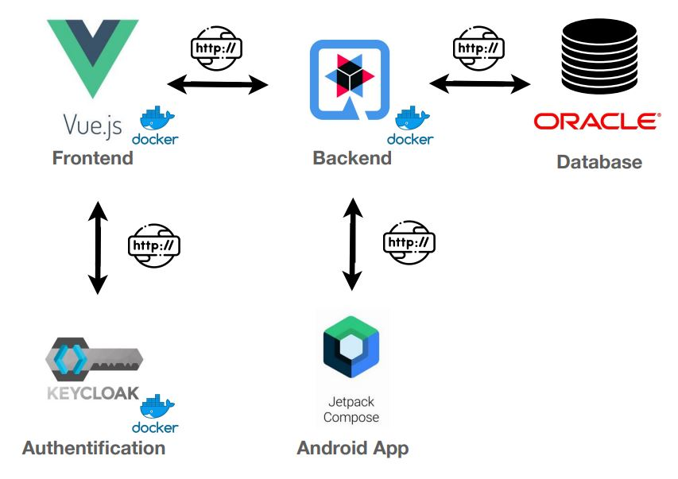
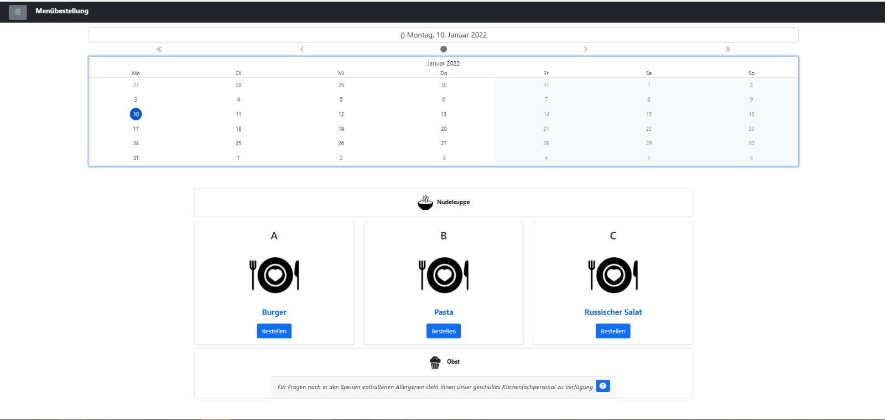
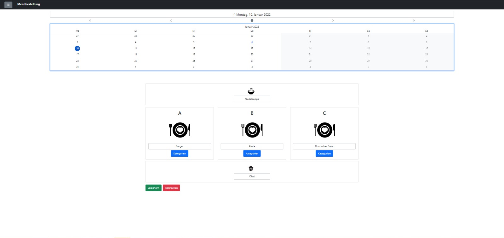
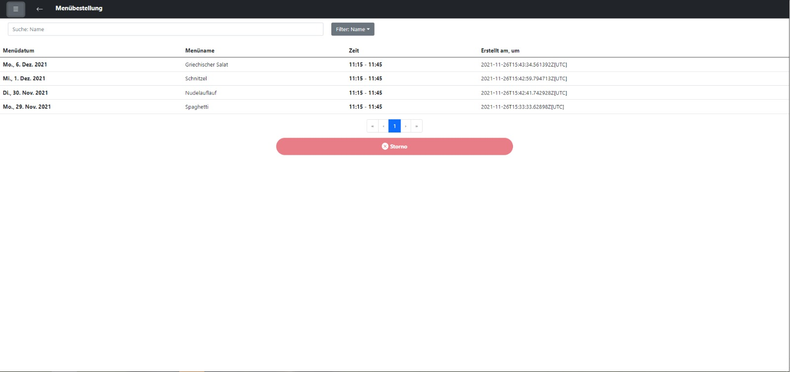
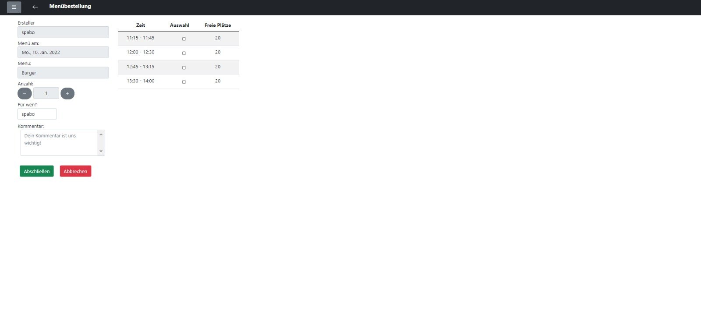
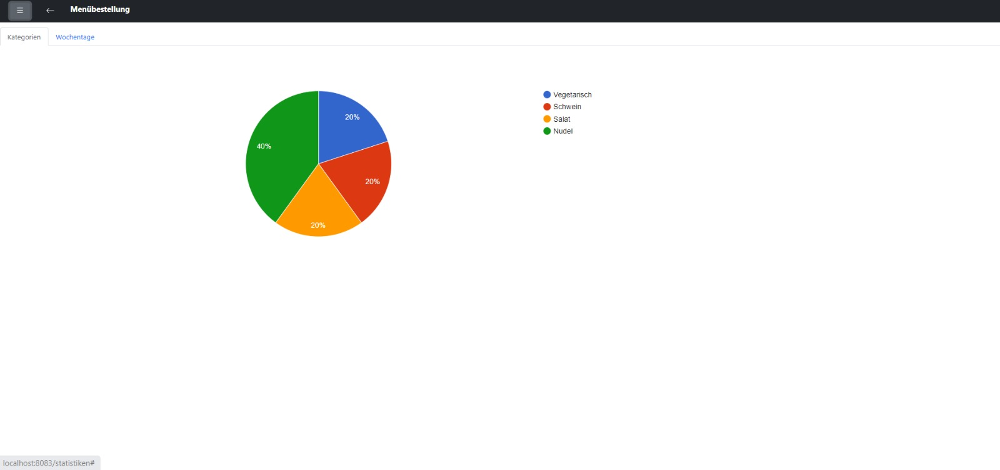
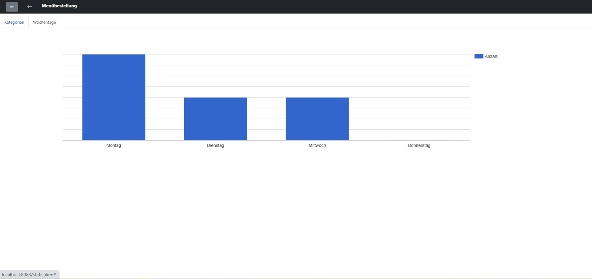

# EazyMenu Documentation

## Info 

EazyMenu ist eine Webanwendung, die für Mitarbeiter entwickelt wird, um essen bei einer Kantine zu bestellen.

## Team

* Benjamin Besic
* David Ignjatovic
* Bozidar Spasenovic

## System Architektur

## Mockups

### Login

### Menü Übersicht Arbeiter

### Menü Übersicht Kantine

### History

### Bestellung

### Statistiken 

#### Meist bestellte Kategorien

#### Wochentag der am öftesten vorkommt

