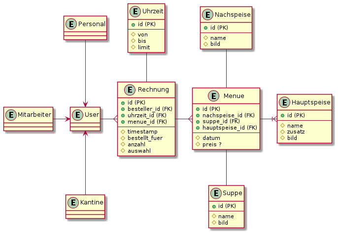
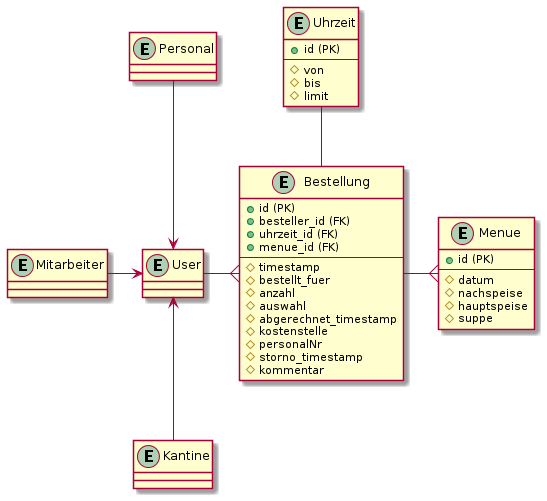
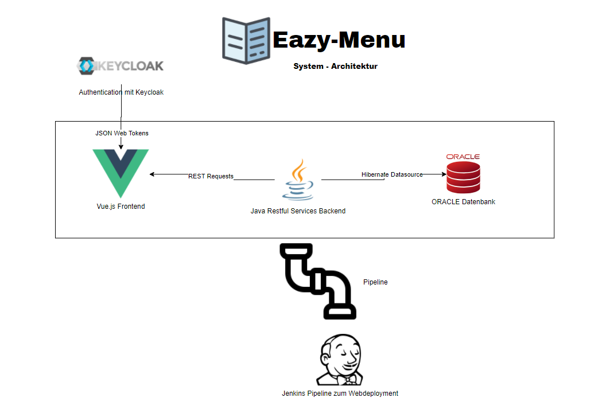
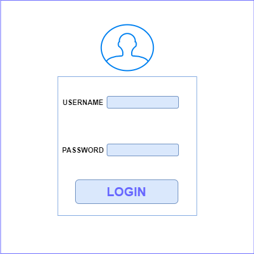
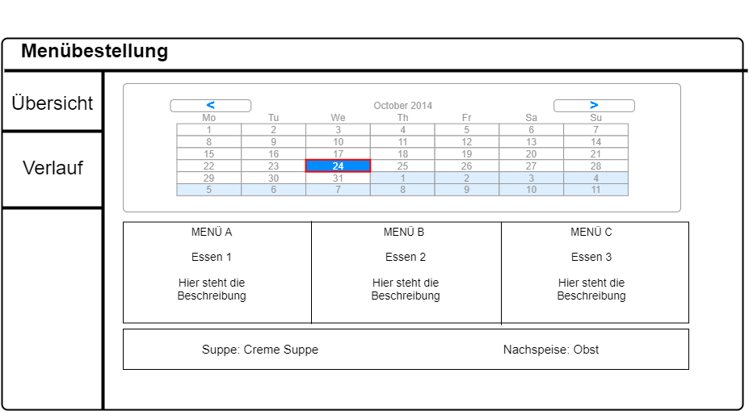
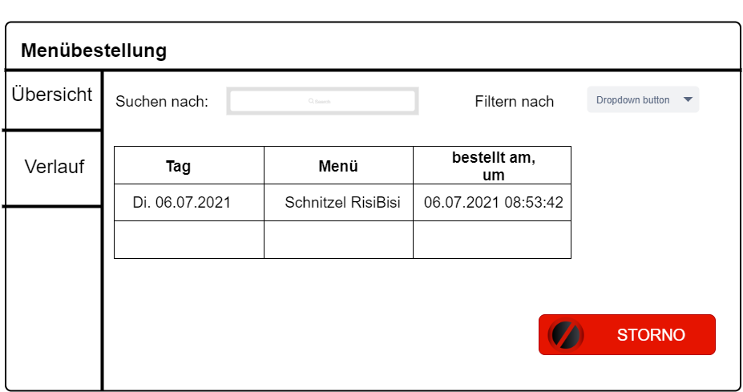

# EazyMenu Documentation

## Anmerkung

Wir werden hier einige Daten einfügen, die wir für unsere Diplomarbeit verwenden werden. Da die Firewall in der Firma Github blockiert werden wir voraussichtlich in dieser Readme alles Dokumentieren.

Github Pages: [EazyMenu Index](https://musikfreunde.github.io/eazy-menu-docs/) (Noch nicht fertig)

## Info 

EazyMenu ist eine Webanwendung, die für Arbeiter der Oberösterreichischen Versicherung entwickelt wird, um essen bei einer Kantine zu bestellen.

## Team

* Benjamin Besic
* David Ignjatovic
* Bozidar Spasenovic

## ERD Alt

Die linke Seite ist schon von der Firma vorgegeben worden. Es werden aber kleine Details geändert und verbessert. 

Dieses ERD ist veraltet. Laut der Firma ist es zu groß und detailliert. Die Kantine findet es besser wenn, es vereinfacht wird.

## ERD Neu

Diese ERD ist (stand 06.07.2021), laut der Firma, in Ordnung und wird auch verwendet.

## System Architektur

## Mockups

### Login

Einfaches Login für die Mitarbeiter, aber auch Kantine und Personal. Wird wahrscheinlich mit Keycloak gemacht.  

### Menü Übersicht 

Hier wird jedes Menü angezeigt zum davor ausgewählten Datum. Der User kann zwischen 3 Mahlzeiten wählen.

### Formular Übersicht (Nach Auswahl des Menüs)

Der User muss nach auswahl der Mahlzeit dieses "Formular" ausfüllen. Die muss auswählen, um wie viel Uhr gegessen wird und wie viel Mahlzeiten konsumiert werden.

### History

Hier werden alle Mahlzeiten angezeigt, welcher der User gegessen hat.

