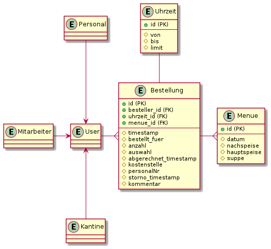

# EazyMenu Documentation

## Anmerkung

Wir werden hier einige Datein einfügen die wir für unsere Diplomarbeit verwenden werden. Da die Firewall in der Firma Github Blockiert werden wir voraussichtlich in dieser Readme alles Dokumentieren.

Github Pages: [EazyMenu Index](https://musikfreunde.github.io/eazy-menu-docs/) (Noch nicht Fertig)

## Info 

EazyMenu ist eine Webanwendung die für Arbeiter der Oberösterreichischen Versicherung entwickelt wird, um essen bei einer Kantine zu bestellen.

## Team

* Benjamin Besic
* David Ignjatovic
* Bozidar Spasenovic

## ERD Alt

Die linke seite ist schon von der Firma vorgegeben worden. Es werden aber kleine Details geändert und verbessert. 

Dieses ERD is veraltet. Laut der Firma ist es zu groß und detailiert. Die Kantine findet es besser wenn es vereinfacht wird.

## ERD Neu

Diese ERD is (stand 06.07.2021), laut der Firma, in Ordnung und wird auch verwendet.

## Mockups

### Logins

### Menü Übersicht 

### Formular Übersicht (nach auswahl des Menüs)

### History

