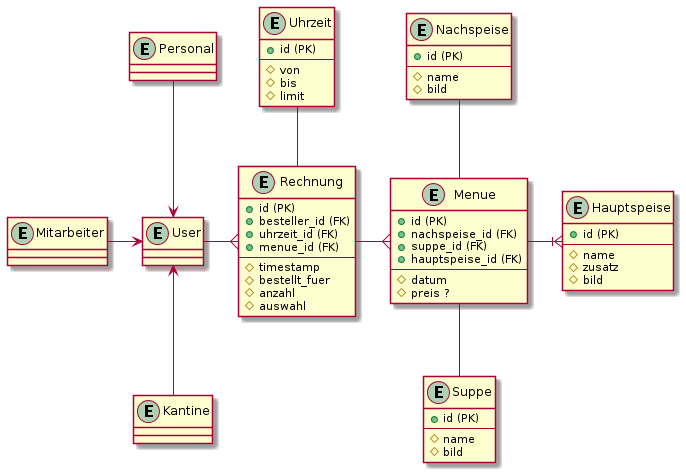
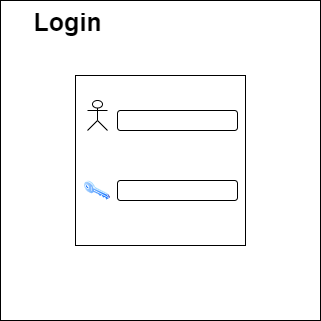

# EazyMenu Documentation

## Anmerkung

Wir werden hier einige Datein einfügen die wir für unsere Diplomarbeit verwenden werden. Da die Firewall in der Firma Github Blockiert werden wir voraussichtlich in dieser Readme alles Dokumentieren.

Github Pages: [EazyMenu Index](https://musikfreunde.github.io/eazy-menu-docs/) (Noch nicht Fertig)

## Info 

EazyMenu ist eine Webanwendung die für Arbeiter der Oberösterreichischen Versicherung entwickelt wird, um essen bei einer Kantine zu bestellen.

## Team

* Benjamin Besic
* David Ignjatovic
* Bozidar Spasenovic

## ERD Alt

## ERD Neu

## Mockups

### Logins

### Menü Übersicht 

### Formular Übersicht (nach auswahl des Menüs)

