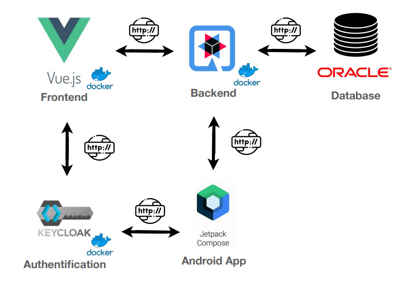
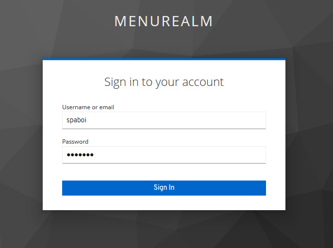
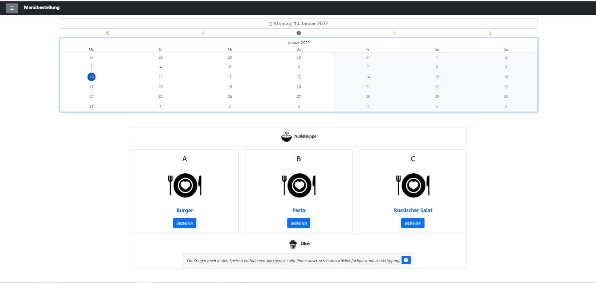
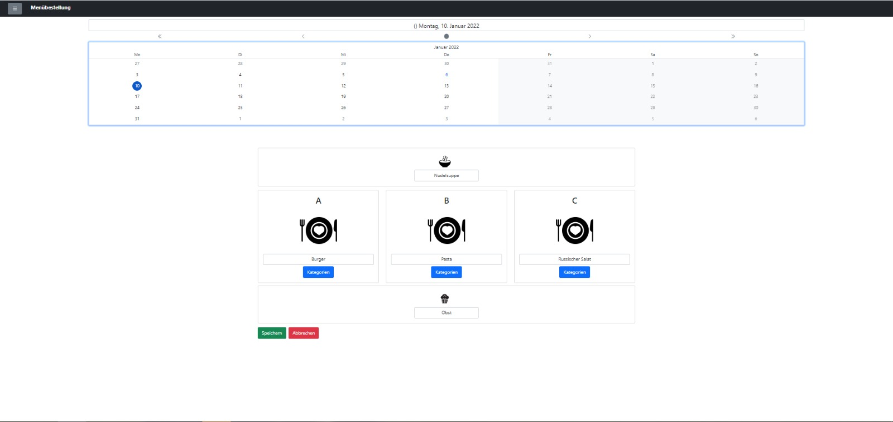
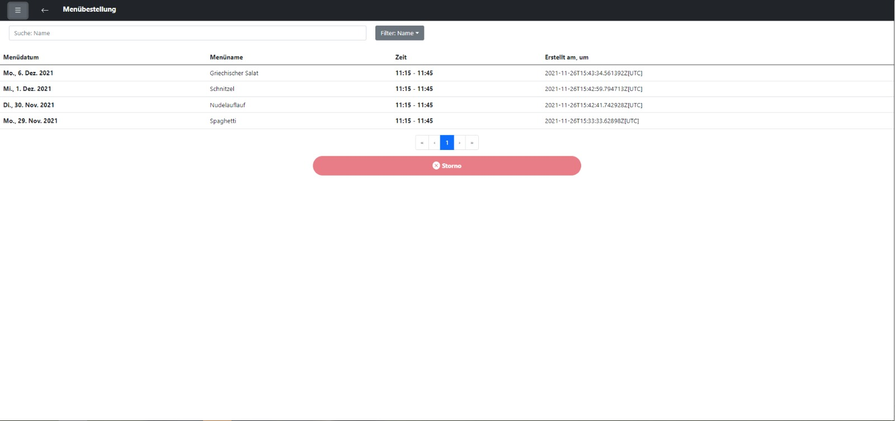
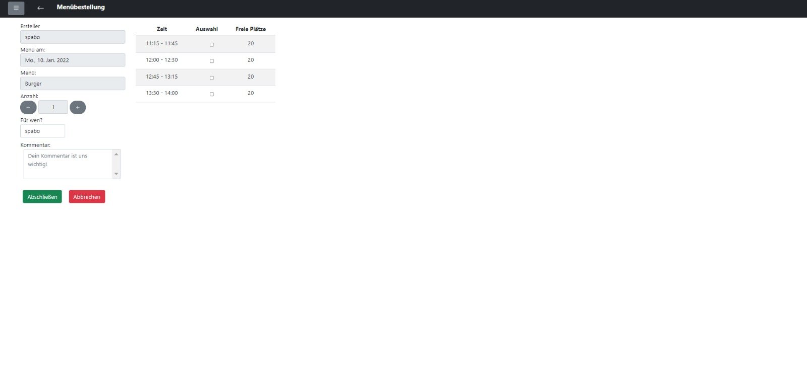
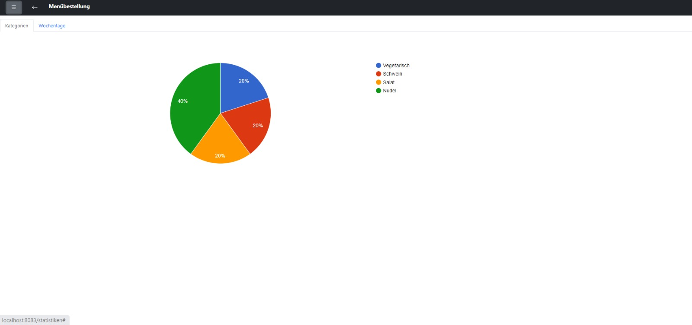
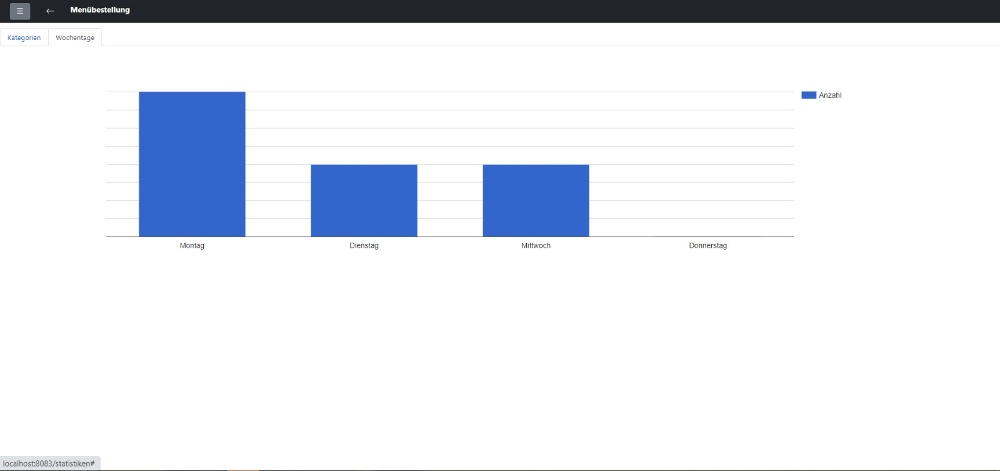

= EazyMenu Documentation

== Info

EazyMenu ist eine Webanwendung, die für Mitarbeiter entwickelt wird, um essen bei einer Kantine zu bestellen.

== Team

* Benjamin Besic
* David Ignjatovic
* Bozidar Spasenovic

== Minutes of Meeting

[cols="1,1"]
|===
|25-10-2021
|https://musikfreunde.github.io/eazy-menu-docs/protokoll-25-10-2021.html[]

|12-11-2021
|https://musikfreunde.github.io/eazy-menu-docs/protokoll-12-11-2021.html[]

|26-11-2021
|https://musikfreunde.github.io/eazy-menu-docs/protokoll-26-11-2021.html[]

|10-12-2021
|https://musikfreunde.github.io/eazy-menu-docs/protokoll-10-12-2021.html[]

|06-01-2022
|https://musikfreunde.github.io/eazy-menu-docs/protokoll-06-01-2022.html[]

|28-01-2022
|https://musikfreunde.github.io/eazy-menu-docs/protokoll-28-01-2022.html[]

|04-02-2022
|https://musikfreunde.github.io/eazy-menu-docs/protokoll-04-02-2022.html[]

|23-02-2022
|https://musikfreunde.github.io/eazy-menu-docs/protokoll-23-02-2022.html[]

|17-03-2022
|https://musikfreunde.github.io/eazy-menu-docs/protokoll-17-03-2022.html[]

|01-04-2022
|https://musikfreunde.github.io/eazy-menu-docs/protokoll-01-04-2022.html[]
|===

== System Architektur

== Mockups

=== Login

=== Menü Übersicht Arbeiter

=== Menü Übersicht Kantine

=== History

=== Bestellung

=== Statistiken

==== Meist bestellte Kategorien

==== Wochentag der am öftesten vorkommt

